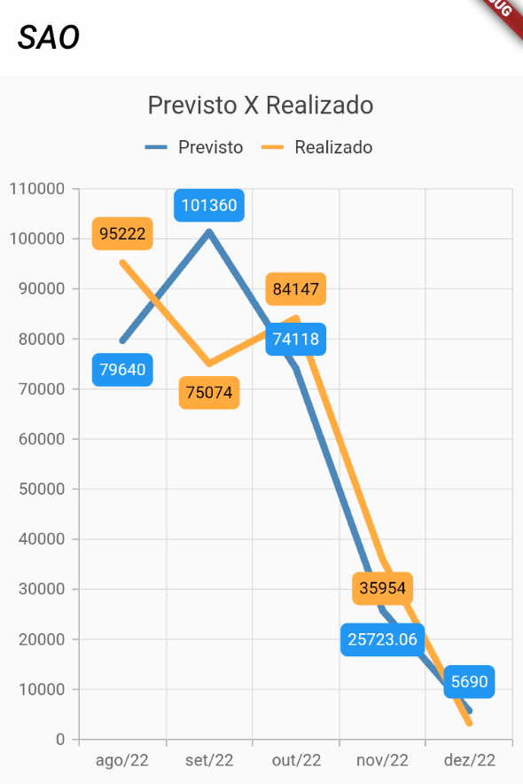

# Flutter Knowledge Test. 
# Teste de Conhecimento em Flutter.

 
## Desenvolvi este projeto com a finalidade de testar alguns conhecimentos em flutter.

#### Bibliotecas Utilizadas:
* syncfusion_flutter_charts : Utilizada para geração dos gráficos.

# Segue o gráfico base para a implementação:

#Segue o gráfico implementado:

